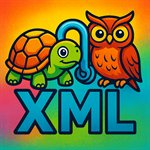

#  User Guide

Welcome to the **Turtle Editor Viewer**. It's a place to write or load RDF, see it drawn as a diagram, and ask it questions with SPARQL. Everything runs in your browser, so nothing you paste in leaves your machine. It understands RDF 1.2 and SPARQL 1.2, with a few gaps listed in [section 5](#5-rdf-12-and-sparql-12). This guide walks through what's on the screen and what each part does.

## 1. Getting Started

### What you're looking at
The window is split into two panes, and you can drag the bar between them to change their widths:

- **Editor pane** (left): where your data lives. There's a code editor, a toolbar above it, and a list of the subjects found in your data so you can pick which ones to draw.
- **Graph and SPARQL pane** (right): the diagram at the top, the SPARQL panel underneath. Drag the bar between those two to give one more room.

Once you've run a query that returns a graph, the editor pane grows a row of tabs along the top. More on that in a moment.

## 2. Working with Data (Editor Pane)

### Getting data in
Three ways, take your pick:

1. **Type or paste** straight into the editor.
2. **Open File** in the toolbar opens a file from your computer. Turtle (`.ttl`), RDF/XML (`.rdf`, `.xml`), JSON-LD (`.json`, `.jsonld`) and Graphviz DOT (`.dot`) all work, and the tab takes the file's name.
3. **Load URL** in the Graph toolbar (right pane) fetches a file from the web. The server hosting it has to allow cross-origin requests (CORS), which most public data servers and GitHub raw links do.

You can also put the URL straight into the page address so a link opens ready-loaded; see [URL parameters](#url-parameters) at the end.

The editor works out the format from the content as you type, so you don't usually need to tell it. If it guesses wrong, the **Language** dropdown sets it by hand.

### Tabs
The editor can hold several documents at once, each in its own tab:

- **Source** is the tab you start in. It holds whatever you typed, opened or loaded.
- **Result 1**, **Result 2** and so on appear when a `CONSTRUCT` or `DESCRIBE` query returns a graph (see [Graph results](#graph-results-construct-and-describe)). They're ordinary documents: edit them, save them, query them, draw them.

Each tab remembers its own text, its own language and its own choice of subjects for the diagram, so flicking between tabs brings each diagram straight back. The tab strip only shows up when there's more than one tab. Close a tab with its **×**; you can close any tab, including Source, except the last one standing. Closing a tab never touches what's in the others.

Two things to keep in mind:

- The subject list, the diagram and the SPARQL panel all work on **whichever tab is in front**. Run a query while a Result tab is showing and you're querying that result.
- Undo history is per tab too, so Ctrl+Z in one tab won't unpick edits in another.

### Editor settings
The toolbar above the editor has:

- **Language**: Turtle, RDF/XML, JSON-LD or DOT. Normally picked for you.
- **Theme**: Light, Dark or High Contrast.
- **Font Size**: 8 to 16 px.

### Saving
**Save File** downloads the current tab's text (as `turtle-file.ttl`, so rename it once it lands).

## 3. Visualizing Graphs

The diagram is drawn with Graphviz from the subjects you pick.

### Choosing what to draw
1. As you type, the app reads your data and lists every **subject** it finds (anything that has properties) in the box on the right of the editor toolbar.
2. Click subjects in that list to draw them; Ctrl-click or Shift-click to pick several. The diagram follows the selection.
3. Type in the **Filter subjects** box to narrow the list. It matches on the label as well as the IRI, so either will find it.
4. **Get All** in the Graph toolbar draws the first ten subjects. When you load a new file the first ten are picked for you as well, so there's something to look at straight away.

**Show labels**, next to the filter box, swaps IRIs for names. If a subject has an `rdfs:label` or `skos:prefLabel`, the list shows that instead of `ex:shop-0042`. Where two subjects share a name the IRI is added after it so you can still tell them apart, and hovering over any entry shows its full IRI.

Blank nodes show up too, when they're the top of a structure rather than nested inside another subject. Ones with a label in the file (`_:g_00`) are listed under that label; anonymous ones (`[] a owl:AllDisjointClasses`) are numbered `anon-0`, `anon-1`… in the order they appear. Those names stay put while you edit, so a blank node you've picked stays drawn.

### Options
The Graph toolbar lets you change how the diagram is laid out and drawn:

- **Engine**: which Graphviz layout to use. `Dot` gives tidy hierarchies, `Neato` and `FDP` are force-directed, `Circo` and `Twopi` are circular, `Osage` clusters.
- **Format**: `SVG` is the one to use day to day; it's what you can pan and zoom. `PNG` gives a picture, and `JSON`, `XDOT`, `Plain` and `PS` are the raw Graphviz outputs.
- **Layout**: the direction the diagram flows: Left → Right, Top → Bottom, and their reverses.
- **Prefixes**: show shortened names like `rdf:type` instead of full IRIs.
- **Hide Types**: leave out `rdf:type` arrows to cut the clutter.
- **Hide Annotations**: leave out labels, comments and the like, so you see structure rather than description.
- **Subjects**: makes the nodes clickable. Click one and a pop-up lists every subject that points at it. On by default; untick it if the pop-ups get in the way while you pan.
- **Sort Subjects**: list subjects alphabetically rather than in the order they appear in the file.
- **Node Labels** and **Property Labels**: use `rdfs:label`/`skos:prefLabel` names in the diagram, for the boxes and for the arrows respectively, the same way **Show labels** does for the subject list. Both are on by default. Turn them off to see the raw IRIs.
- **Link Triple Terms**: see the next section.
- **Raw**: for SVG, show the SVG text itself rather than the picture. Useful if you want to copy it somewhere.

### RDF 1.2: triple terms and annotations
RDF 1.2 lets a triple be talked *about*. In Turtle that looks like `<<( :shop :founded "1921" )>>` when you refer to the triple directly, or `:shop :founded "1921" {| :claimedBy :source |}` when you attach notes to it as you write it. Under the hood both use `rdf:reifies` and a triple term.

The diagram draws each triple term as its own node, in **dark green**, showing the triple it stands for. Blank nodes look just as they always have.

Tick **Link Triple Terms** and each green node also gets dashed dark-green arrows to the subject and the object it mentions, labelled `subject` and `object`, wherever those happen to be in the diagram. They don't affect the layout, so switching them on won't rearrange anything.

### Getting around
- **Pan and zoom**: scroll to zoom, drag to pan (SVG only).
- **Click a node** and a pop-up lists every subject that points at it, which is a quick way to find who refers to a value. (That's the **Subjects** option; untick it to turn the pop-ups off.)

## 4. Querying with SPARQL

The panel at the bottom right runs SPARQL against the tab that's in front.

### Running a query
1. Write your query in the box. It has syntax colouring, and the tab-switching rules above apply: the data being queried is whatever's in the active tab.
2. **Add Prefixes** pastes in `PREFIX` lines for every prefix declared in your data, so you needn't type them.
3. **Execute Query** runs it. **Clear Results** tidies up afterwards.
4. **Export Query** saves the query text as `query.sparql`.

### What you can ask
The engine (Comunica) speaks SPARQL 1.2, so everything from 1.1 plus the newer additions:

- `SELECT`: a table of answers.
- `ASK`: yes or no.
- `CONSTRUCT` and `DESCRIBE`: a graph, which can go straight into a new tab.
- RDF 1.2 in queries: annotation blocks `{| |}` in patterns, triple terms `<<( )>>`, and `rdf:reifies`, all match what's in your data. Literals with a text direction (`"مرحبا"@ar--rtl`) keep it.

### Reading the results
`SELECT` answers appear as a table. Language-tagged text shows its tag (`hello@en`, or `مرحبا@ar--rtl` when it has a direction) and a triple term is written out as `<<( s p o )>>`.

**Export Results** offers CSV or JSON for a table. The JSON follows the SPARQL 1.2 results format, so other 1.2-aware tools can read it, triple terms and all. For a graph result it saves Turtle as `results.ttl`.

### Graph results (`CONSTRUCT` and `DESCRIBE`)
A graph result comes back as Turtle, written with the prefixes from your data, duplicates removed, and only the prefixes it actually uses declared at the top.

Where it goes depends on the **Graph results to tab** box among the SPARQL buttons:

- **Ticked** (the default): the graph opens as a new **Result** tab in the editor, every subject in it is selected, and the diagram draws it straight away. The results panel just notes where it went and how many triples there were. From there you can tidy it, save it with **Save File**, or query it again.
- **Unticked**: the Turtle appears in the results panel as before, and nothing else changes.

Either way **Export Results** still saves it.

### Things that catch people out
- **`HAVING` can't see your `AS` names.** In `SELECT ?shop (COUNT(?x) AS ?n) … HAVING (?n > 1)`, `?n` isn't bound yet when `HAVING` runs, so nothing comes back. Repeat the aggregate instead: `HAVING (COUNT(?x) > 1)`. That's how SPARQL is specified, not a quirk of this engine.
- **A `CONSTRUCT` template holds triples only.** Sub-selects, `OPTIONAL`, `FILTER` and other `{ }` blocks belong in the `WHERE` part. Put one in the template and the parser will complain that it expected `}` and found `{`.
- **You're querying the active tab.** If a query that worked a minute ago suddenly returns nothing, check which tab is in front.

## 5. RDF 1.2 and SPARQL 1.2

The parser (n3.js 2.2) and the query engine (Comunica 5.3) both speak the 1.2 versions of the standards, and the app has been checked against each feature below. Here's what you can rely on, and what to watch for.

### What works
- **Turtle 1.2 input**: the `VERSION "1.2"` line; triple terms `<<( s p o )>>`, nested ones included; annotations `{| … |}`; reifiers, whether written `~ :r`, `<< s p o >>` or `<< s p o ~ :r >>`; literals with a text direction such as `"مرحبا"@ar--rtl`; and `rdf:JSON` literals.
- **JSON-LD input**: `@direction` on a value is read and kept.
- **SPARQL 1.2**: all of the above in `WHERE` patterns and in `CONSTRUCT` templates; the `VERSION` line; `TRIPLE`, `SUBJECT`, `PREDICATE`, `OBJECT` and `isTRIPLE`; `LANGDIR`, `hasLANG`, `hasLANGDIR` and `STRLANGDIR`.
- **Results**: the table shows triple terms as `<<( s p o )>>` and directions as `@ar--rtl`; the JSON export uses the SPARQL 1.2 results format (`"type": "triple"`, `"its:dir"`).
- **Turtle output**, whether from a query, **To Turtle** or **Save File**: triple terms and directions come out as they went in.
- **Diagram**: triple terms as dark-green nodes, reifier blank nodes, and the optional dashed links.
- **Reasoner**: runs over 1.2 data. A triple term is treated as a single value to reason *about*, not something to reason *inside*, and **Show Facts** prints triple terms and directions properly.

### What doesn't, yet
- **RDF/XML input** predates 1.2: a triple term written as `rdf:parseType="Triple"` is dropped without a word, and an `its:dir` direction is ignored (the language tag survives).
- **To JSON-LD** has no way to write a triple term, so it fails if your data has any. A literal's text direction is dropped too, as JSON-LD `@direction` isn't written out.
- **The diagram shows a literal's text only**: no language tag, direction or datatype, so `"مرحبا"@ar--rtl` looks like any other string. That's true of ordinary `@en` tags as well.
- **Inferred triples** that copy a literal with a direction (say, through `rdfs:subPropertyOf`) come back from the reasoner without the direction.
- **CSV export** is plain values: a triple term becomes the text `<<( s p o )>>`, and language tags and directions are left off.
- **SPARQL Update** (`INSERT`, `DELETE`, whether 1.1 or 1.2) isn't run. The panel only asks questions; change data in the editor.

## 6. Advanced Features

### Reasoning (Hylar)
There's a built-in OWL 2 RL reasoner. Click **Show Facts** in the Graph toolbar and a new window lists the **explicit** triples (the ones in your data) and the **implicit** ones the reasoner worked out from them.

### Format conversion
**To Turtle** and **To JSON-LD** in the Graph toolbar rewrite the active tab's data in that format, in place.

### URL parameters
Add these to the page address to open it with data already loaded:

- `?dot=<url>`: fetch a Turtle or DOT file from that address.
- `?rdfa=<url>`: fetch that address too. If it returns RDF it's loaded as normal; pulling RDFa out of an HTML page isn't implemented yet, so a web page just gets a note saying so.

Remember to URL-encode the address you pass in.

---
*Turtle Editor Viewer v2.0.0*
